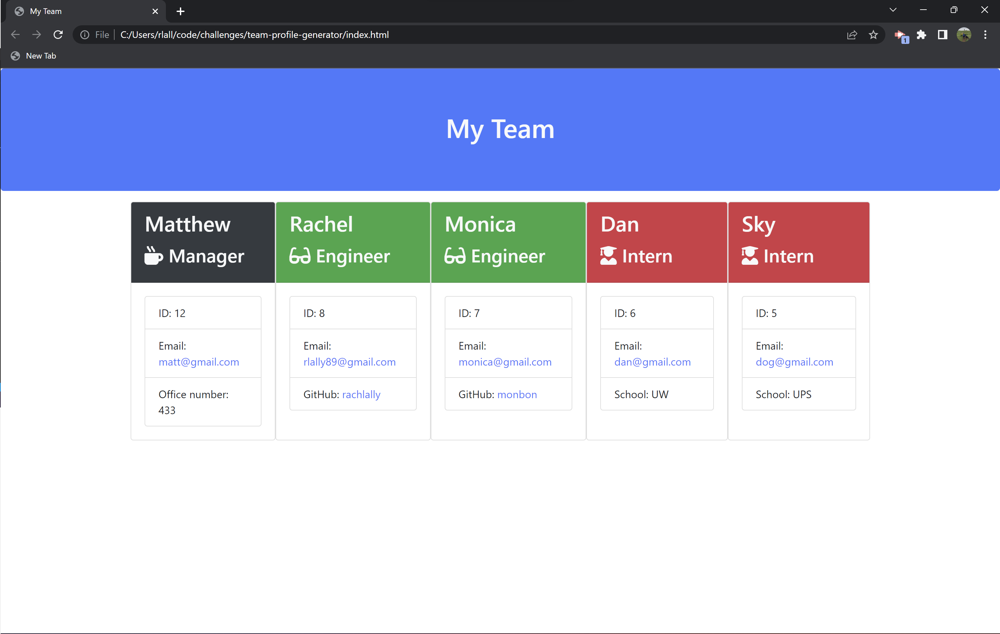

# Team Profile Generator
Helping software engineering teams create team profiles

## Description

The purpose of this Team Profile Generator is to provide software engineering teams a tool they can use to easily organize and view their entire team in one spot.  With teams growing and changing frequently, this is a useful application that takes minimal effort to fill out but is a huge time saver when needing to find a team member's information. 

I learned how to create constructor classes and extend certain characteristics to subclasses.  I learned how valuable running tests is.  I utilized a Switch Case for the first time which helped create an easy to read function that may have been complicated and nested otherwise.

## Installation

For installation, pull repository to your local computer: https://github.com/rachlally/team-profile-generator .

## Usage

Once installed, navigate to the command-line, enter:

```bash
node index.js
```

User is guided through a series of questions, gathering information about the Manager, Engineers, and Interns.  First the user will add information for the Manager.  After, user will have a choice to add Engineer or Intern.  The user can add additional Engineers or Interns.  When finished, select "finished".  A html will be generated including information provided.  Open in browser.  The Manager will have a black card.  Engineers will have a green card.  Interns will have a red card.


For a demo of the Team Profile Generator: https://drive.google.com/file/d/1tHGWfok4v6qH7Ao-1ez7_sSyZd8EY1GP/view .


For a sample index.html, navigate to the sample folder.  Click on the index.html.




## Tests

To run tests:

```bash
npm run test
```

## Credits

Thankful for the support of my instructional team!

## License

MIT License

Copyright (c) 2022 rachlally

Read full license, available in LICENSE file.

